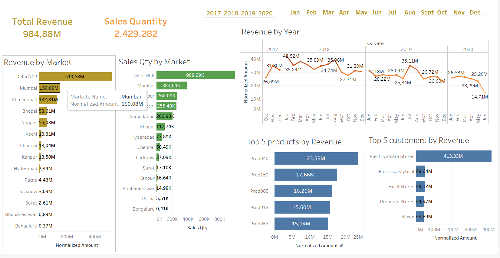
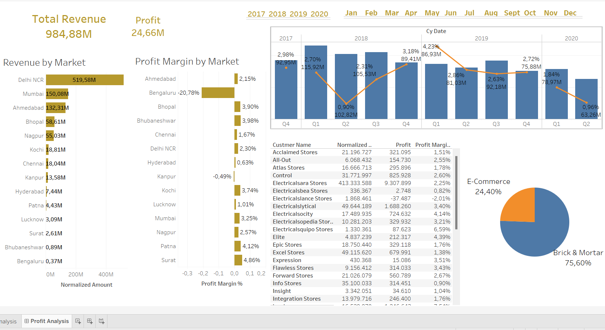

# Sales Insights for AtliQ Hardware


## 📋 Table of Contents
1. [Project Overview](#-project-overview)
2. [Objectives](#-objectives)
3. [Tools Used](#%EF%B8%8F-tools-used)
4. [Repository Contents](#-repository-contents)
5. [Key Dashboards](#-key-dashboards)
   - [Revenue Analysis](#1-revenue-analysis)
   - [Profit Analysis](#2-profit-analysis)
6. [How to Use This Project](#-how-to-use-this-project)
7. [Tableau Public Link](#-tableau-public-link)


## 📊 Project Overview
AtliQ Hardware, a computer hardware and peripherals manufacturer headquartered in Delhi, India, is facing declining sales. The company's sales director needs insights into revenue and profit trends to make data-driven decisions.

This project unlocks sales insights that were previously unavailable to the sales team and automates them to reduce manual effort. The final deliverable is an interactive Tableau dashboard that provides quick and actionable insights to support data-driven decision-making.


## 🎯 Objectives
1. **Revenue Breakdown**:
   - By cities.
   - By year and month.
2. **Top Performers**:
   - Top 5 customers by sales quantity and revenue.
   - Top 5 products by revenue.
3. **Profit Insights**:
   - Profit margins by market and customer.
4. **Automation**:
   - Minimize manual data gathering and processing time.


## 🛠️ Tools Used
- **Tableau Desktop**: For creating dashboards.
- **MySQL Workbench**: For data import and manipulation.
- **SQL**: To prepare and query the data.


## 📂 Repository Contents
### 1. **Data**
- `db_dump.sql`: SQL script to create and populate the database.

### 2. **Dashboards**
- `Sales Insight - AtliQ Hardware.twbx`: Tableau Packaged Workbook containing:
  - **Revenue Analysis Dashboard**: Insights into revenue by market, year, and month.
  - **Profit Analysis Dashboard**: Insights into profit margins, customers, and markets.

### 3. **Screenshots**
- `revenue_analysis.png`: Preview of the Revenue Analysis dashboard.
- `profit_analysis.png`: Preview of the Profit Analysis dashboard.


## ✨ Key Dashboards
### 1. Revenue Analysis


- **Total Revenue**: ₹984.88M
- **Sales Quantity**: 2.43M
- **Key Insights**:
  - Top revenue-generating market: **Delhi NCR**.
  - Top 5 products by revenue: `Prod040`, `Prod159`, `Prod065`, `Prod018`, `Prod053`.
  - Top 5 customers by revenue: `Electricalsara Stores`, `Electricalsytical`, `Excel Stores`, `Premium Stores`, `Nixon`.


### 2. Profit Analysis


- **Total Revenue**: ₹984.88M  
- **Total Profit**: ₹24.66M  
- **Key Insights**:
  - Profit margin breakdown by market and year.
  - Highest profit margins are from **Ahmedabad** and **Delhi NCR**.
  - E-Commerce vs Brick & Mortar distribution: **24.40%** and **75.60%**, respectively.


## 🚀 How to Use This Project
1. Clone the repository:
   ```bash
   git clone https://github.com/amruthamanoharan/Tableau-Sales-Insight-AtliQ-Hardware.git
   ```
2. Import the SQL database:
    Use `db_dump.sql` to set up the database in MySQL Workbench.
3. Open the Tableau Packaged Workbook:
    Use Tableau Desktop to view the dashboards (`Sales Insight - AtliQ Hardware.twbx`).
4. Explore and interact with the dashboards.


## 📥 Tableau Public Link
You can interact with the published dashboards here:
[AtliQ Hardware Sales Insights Dashboard](https://public.tableau.com/app/profile/amrutha.manoharan/viz/SalesInsight-AtliQHardware_17387035352940/RevenueAnalysis)


